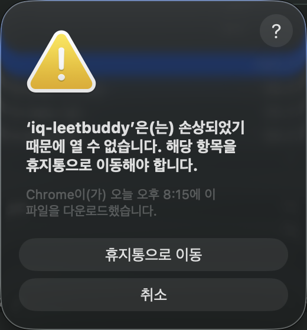

# 🪐 iq-leetbuddy

> *a small companion in the iq-agent-lab system.*

LeetCode 문제 풀이를 **한국어로 번역해 보여주고**, 통과한 코드에 **AI 회고**를 붙여 **GitHub에 자동 정리**하는 데스크톱 에이전트.

iq-agent-lab 행성 중 하나. 매일 문제 풀이를 *기록 가능한 학습 자산*으로 바꾸는 것이 이 행성의 일.

---

## 📥 다운로드 & 설치

빌드 없이 그냥 받아 쓰는 길.

### 1. 본인 Mac에 맞는 zip 다운로드

**[Releases](https://github.com/iq-agent-lab/iq-leetbuddy/releases/latest)** 페이지로 가서 다음 둘 중 하나 받기:

| Mac 종류 | 파일 |
|---|---|
| Apple Silicon (M1, M2, M3, M4) | `iq-leetbuddy-{version}-arm64-mac.zip` |
| Intel Mac | `iq-leetbuddy-{version}-mac.zip` |

> 본인 Mac이 어느 쪽인지 모르면: `메뉴 → 이 Mac에 관하여`. "Apple M*" 보이면 Apple Silicon, "Intel" 보이면 Intel.

### 2. ⚠️ 그냥 zip 풀어서 실행하면 — 이렇게 됨



다운로드한 zip을 풀어서 `.app` 파일을 더블클릭하면 macOS가 위 같은 경고를 띄움:

> **'iq-leetbuddy'은(는) 손상되었기 때문에 열 수 없습니다. 해당 항목을 휴지통으로 이동해야 합니다.**

**진짜 손상된 게 아니야.** Chrome으로 다운받은 unsigned 앱에 macOS가 `com.apple.quarantine`이라는 "출처 모름" 꼬리표를 붙이고, Gatekeeper가 그걸 보고 *손상이라고 거짓말*하면서 차단하는 거. Apple Developer cert가 있는 *서명된* 앱이면 안 뜨는데, iq-leetbuddy는 개인 도구라 cert 없음.

휴지통으로 옮기지 말고 — **터미널 한 줄로 우회 가능**.

### 3. 터미널에서 한 번에 설치

새 터미널을 열고 (Spotlight → "터미널") 다음을 복사 붙여넣기:

```bash
cd /tmp && \
unzip -o ~/Downloads/iq-leetbuddy-*-mac.zip && \
xattr -cr iq-leetbuddy.app && \
mv -f iq-leetbuddy.app /Applications/ && \
open /Applications/iq-leetbuddy.app
```

각 줄이 하는 일:

| 명령 | 의미 |
|---|---|
| `cd /tmp` | 작업 디렉토리로 이동 |
| `unzip -o ~/Downloads/...` | Downloads의 zip 풀기 (Apple Silicon/Intel 자동 매칭) |
| `xattr -cr iq-leetbuddy.app` | quarantine 꼬리표 제거 (이게 핵심) |
| `mv -f ... /Applications/` | Applications 폴더로 옮기기 (기존 버전 덮어쓰기) |
| `open ...` | 실행 |

성공하면:
- Dock에 코랄 행성 아이콘이 떠오르고
- 메뉴바 우측 상단에도 🪐 트레이 아이콘 자리잡고
- iq-leetbuddy 창이 열림

다음번부터는 Launchpad / Spotlight / Dock에서 일반 앱처럼 켜기 가능.

### 4. 첫 실행 — 설정 자동 안내

키가 둘 다 비어 있는 첫 실행이면 **자동으로 ⚙️ 설정 모달이 열림** (0.5초 후). 닫아도 같은 세션에선 다시 안 띄움.

1. **Anthropic API Key**: https://console.anthropic.com → API Keys → 키 발급 → 붙여넣기
2. **GitHub Personal Access Token**: 토큰 라벨 옆 `?` 버튼 → 가이드 패널 안의 발급 링크 클릭 → `repo` scope 미리 체크된 페이지 열림 → Generate token → 한 번만 보이는 토큰 복사 → 붙여넣기
3. **Owner / Repository**: 본인 GitHub 사용자명 + 풀이 레포 이름 (예: `e9ua1` / `leetcode-solutions`)
4. **"GitHub 연결 확인"** 버튼 → 토큰/레포 한 번에 진단. 레포 없으면 그 자리에서 **"지금 만들기"** 클릭
5. (선택) **"레포 없을 때 자동 생성"** 토글 켜기

저장 후 메인 화면에서 LeetCode 문제 URL이나 문제 이름을 던지면 끝.

> 설정 중 누락이나 401 발생 시에도 자동으로 모달이 다시 열려서 안내함 — `.env` 파일을 직접 만질 일 없음.

---

## 무엇을 하는가

```
01 ─ 문제 던지기
       URL · slug · 문제 이름 자유 — 대소문자/공백/언더스코어 자동 정규화
       또는 임베드 LeetCode 윈도우에서 → leetbuddy로 가져오기 chip
       또는 최근 풀이 5개 chip 클릭

02 ─ Claude streaming 번역 (한국어 마크다운)
       이미지·예시·제약조건·메타 보존
       시작 코드는 LeetCode가 주는 모든 언어 select
       마지막 선택 언어 자동 기억

03 ─ LeetCode 사이트에서 직접 풀고 Accepted 받기
       임베드 윈도우는 영속 세션 — 한 번 로그인하면 다음에도 유지

04 ─ 통과 코드 붙여넣고 업로드

05 ─ Claude streaming 회고
       알고리즘 로직은 100% 동일 유지 (재해석)
       의미 있는 변수명 + 한국어 한 줄 주석
       복잡도 + 대안 접근 + 비슷한 문제 추천

06 ─ 단일 atomic commit으로 GitHub 업로드
       NNNN-title-slug/
         ├── README.md            (한국어 번역, 공통 — 변경 없으면 skip)
         └── {language}/
             ├── solution.{ext}    (통과 코드)
             └── RETROSPECTIVE.md  (AI 회고)
```

문제 하나당 사용자 행동은 **두 번의 붙여넣기 + 두 번의 클릭** (또는 임베드 chip 사용 시 더 적게). 나머지는 다 알아서.

---

## 왜 만들었는가

LeetHub 계열 확장은 *제출 후 GitHub에 올리기*는 해주지만, 핵심이 다 빠져 있다:

- LeetCode 문제는 영어라 한국어 학습자에게 *이해 자체가 비용*이고,
- 코드만 commit되면 **나중에 그 풀이를 다시 꺼냈을 때 맥락을 잃는다.**
- 회고 없이 정답 코드만 쌓으면, 100문제 풀어도 95문제는 잊는다.

iq-leetbuddy는 *commit*이 아니라 *학습*을 자동화한다.

- **번역은 풀이 *전*에** — 영어 해독 시간 → 알고리즘 사고 시간으로 전환
- **회고는 풀이 *후*에** — 복잡도, 개선 코드(한국어 주석), 대안 접근, 유사 문제까지
- **레포는 *학습 노트*** — 미래의 본인이 들춰봤을 때 풀이뿐 아니라 *왜*가 같이 있음

장기적으로 풀이 레포 자체가 "내가 어떻게 사고했는가"의 아카이브가 된다.

---

## 핵심 기능

### 입력 robust 처리

대소문자, 공백, `-`, `_` 모두 **자동 정규화**:

```
✓ https://leetcode.com/problems/two-sum/
✓ https://leetcode.com/problems/two-sum/description/
✓ https://leetcode.com/problems/regular-expression-matching/description/?envType=problem-list-v2&envId=depth-first-search
✓ leetcode.cn/problems/two-sum
✓ Two Sum
✓ symmetric tree
✓ TWO_SUM
```

입력하는 동안 input 아래에 `→ two-sum 으로 정규화` **paste preview**가 실시간 표시 — 잘못 입력했는지 미리 확인 가능.

### Streaming 번역/회고

번역(step-2)과 회고(step-4) 둘 다 **Anthropic streaming API** 사용. spinner 30초+ 보다가 텅 빈 결과 받는 흐름이 아니라, **즉시 첫 문장부터 점진 표시**. 4000 토큰 회고도 첫 줄이 1-2초 안에 보이기 시작함.

- 좌측 코랄 라인 + spinner로 진행 시각화
- 완료 시 안정적인 최종 HTML로 교체 (incomplete markdown 정리)
- main에서 120ms throttle + `renderPromise` 체인 → 부하 + race 안 만듦

### 임베드 LeetCode 양방향 URL 전달

별도 **영속 세션 윈도우**(`persist:leetcode` 파티션). 한 번 로그인하면 앱을 껐다 켜도 유지됨. 메인 leetbuddy UI는 절대 navigate 안 됨 — 풀이 흐름 중에 작업 컨텍스트 안 잃음.

**임베드 → 메인**: 임베드에서 둘러보다 "이거 풀자" 결정한 문제를 메인 input으로 (3 경로):
- 임베드 윈도우 우하단 **"→ leetbuddy로 가져오기"** 코랄 chip
- 메뉴바: **⌘⇧↩** (Cmd+Shift+Return)
- 메인 윈도우 input 옆 **"↩ 임베드에서"** 보조 버튼

세 경로 모두 메인 윈도우 자동 활성화 + URL 자동 입력 + fetch 자동 시작.

### 원문 클릭 시 시작 언어 자동 안내

번역 결과 안 `[원문]` 링크를 클릭하면 현재 step-2에서 선택한 시작 언어를 URL hash에 담아 임베드로 전달:
- **토스트** (확정 동작) — 우상단에 "선택된 시작 언어: Python3" 5초 표시
- **DOM 자동 조작 시도** (best-effort) — LeetCode lang dropdown 자동 클릭. LeetCode UI 변경에 fragile하므로 실패해도 토스트는 보장됨

### 시작 언어 기억 (LocalStorage)

step-2에서 한 번 Java→Python으로 바꾸면 **다음 문제부터 자동으로 Python**. 매번 dropdown을 클릭하는 마찰 제거. 저장된 lang이 새 문제에 없으면 java fallback → 첫 번째 fallback.

### 최근 풀이 5개 chips

fetch 성공한 문제는 step-1에 코랄 톤 카드로 chip 표시 (최대 5개, LRU + dedup). 클릭하면 자동 fetch — 같은 문제 다른 언어로 풀거나 회고를 다시 보려고 할 때 한 클릭.

### 번역 결과 캐시

같은 titleSlug 두 번 fetch 시 **LLM 호출 skip**, 즉시 final HTML 표시. 캐시는 `userData/cache/translations/{slug}.json`. LeetCode 문제는 거의 안 바뀌므로 만료 없음.

캐시 무효화: `~/Library/Application Support/iq-leetbuddy/cache/translations/` 폴더 삭제.

### Syntax highlighting

시작 코드 + 통과 코드 입력란 + **번역/회고 영역의 코드 블록** 모두 highlight.js (atom-one-dark) 적용. 통과 코드 textarea는 **overlay 트릭** (transparent textarea 위에 highlighted `<pre>` 정확히 겹침)으로 *편집 가능한 상태에서도 syntax color 유지*.

### AI 회고

`src/services/annotator.ts`의 프롬프트는 다음을 강제한다:

- **알고리즘 로직 100% 동일 유지** (개선이 아니라 *재해석*)
- 의미 없는 변수명 → 의미 있는 이름
- 핵심 단계마다 한국어 한 줄 주석
- 시간/공간 복잡도 + *왜* 그런지의 짧은 설명
- 대안 접근 1~2가지 (트레이드오프 포함)
- 비슷한 LeetCode 문제 추천 2~3개

### 단일 atomic commit + 언어별 폴더 + README 중복 skip

3개 파일이 *하나의 commit*으로 올라간다. **git data API**로 blob → tree → commit → ref 업데이트 직접 호출. 같은 문제를 여러 언어로 풀어도 **언어별 하위 폴더**로 분리되어 회고가 덮어써지지 않음.

**README는 한 번만**: 같은 문제 다른 언어로 풀 때 README가 동일 내용으로 매번 push되던 git history noise 제거. 기존 sha 내용과 비교해 같으면 commit에서 제외 (`fileNeedsUpdate`). solution / RETROSPECTIVE는 사용자 의도(개선 push)가 있을 수 있어 항상 commit.

```
feat: 101. Symmetric Tree (java) 풀이 추가
feat: 101. Symmetric Tree (python, README 변경 없음) 풀이 추가
```

### 친절한 에러 + 자동 복구

GitHub API 에러는 **HTTP status code별 한국어 진단 메시지**. 401 / API 키 누락 / `GITHUB_TOKEN` 누락 등 **credential 에러는 자동으로 설정 모달 안내**. 404 시 *"이 이름으로 새 레포 만들기"* 버튼이 자동 노출 — 자동 생성 토글이 켜져 있으면 *AI 회고 비용 추가 없이* (annotated 재사용) 레포 만들고 retry까지 자동.

input 자체에도 fetch 실패 시 **red border + shake 애니메이션** → 어디가 잘못됐는지 즉시 보임.

### 글로벌 단축키

- **⌘⌥L** (글로벌, 점유 시 `⌘⌥B → ⌘⌥J → ⌘⇧L` fallback) — 어떤 앱에 있든 leetbuddy로 호출
- **⌘⇧↩** — 임베드 LeetCode URL을 메인 input으로 (앱 active 시)
- **⌘K** (앱 내) — 입력/결과 모두 초기화 (= "다음 문제 가져오기" 버튼)
- 메뉴바 🪐 트레이 아이콘 클릭
- `View → leetbuddy 보이기/포커스`

---

## 결과물: GitHub에 이렇게 쌓인다

```
{owner}/{repo}/
├── 0001-two-sum/
│   ├── README.md             ← 한국어 번역 (공통, 중복 skip)
│   ├── python/
│   │   ├── solution.py
│   │   └── RETROSPECTIVE.md  ← Python 풀이 회고
│   └── java/
│       ├── solution.java
│       └── RETROSPECTIVE.md  ← Java 풀이 회고
│
├── 0094-binary-tree-inorder-traversal/
│   ├── README.md
│   └── cpp/
│       ├── solution.cpp
│       └── RETROSPECTIVE.md
│
└── 0101-symmetric-tree/
    ├── README.md
    └── java/
        ├── solution.java
        └── RETROSPECTIVE.md
```

- 폴더명 `{4자리 번호}-{titleSlug}` → GitHub 파일 브라우저에서 자연 정렬
- **언어별 하위 폴더**로 풀이/회고 분리 → 같은 문제 여러 언어 풀어도 회고 보존
- README는 공통 1회 commit, 같은 내용이면 재push skip

---

## 비용

문제당 Claude API 호출 = 번역 + 회고 = **2회** (캐시 hit이면 회고만 1회).
Sonnet 4.6 기준 **문제당 약 $0.02~0.04**. 월 100문제 풀어도 $2~4 수준.

GitHub API는 시간당 5,000 requests 한도, 문제당 ~9 calls (README 변경 확인 1회 + git data API 8회). 555문제까지 여유.

---

## 단축키

| 단축키 | 기능 |
|---|---|
| `⌘⌥L` (글로벌) | 어떤 앱에 있든 leetbuddy로 호출 |
| `⌘⇧↩` (앱/임베드 active) | 임베드 LeetCode URL을 메인 input으로 + 자동 fetch |
| `⌘K` (앱 내) | 입력/결과 모두 초기화 |
| `Enter` (문제 입력란) | 불러오기 |
| `Esc` (설정 모달) | 모달 닫기 |
| `⌘Q` | 완전 종료 |

---

## ⚙️ 개발자용 — 소스에서 빌드

위 다운로드 섹션 안 보고 직접 코드로 굴리고 싶다면.

### 의존성

- Node.js 20+
- macOS 13+ (또는 Windows 10+ / Ubuntu 20.04+)

### 로컬 실행

```bash
git clone https://github.com/iq-agent-lab/iq-leetbuddy.git
cd iq-leetbuddy
npm install
npm start
```

`npm start`는 `tsc + copy-assets + electron .` 한 번에. dev 모드는 DevTools detach 모드로 자동 오픈 (`npm run dev`).

API 키/토큰은 **앱 안 ⚙️ 모달에서 입력**. dev 모드는 프로젝트 루트 `.env`, packaged는 `userData/.env`에 저장됨.

### 직접 패키징 (배포 파일 만들기)

```bash
npm run dist:mac           # macOS .zip (현재 아키텍처)
npm run dist:mac-universal # M-시리즈 + Intel 둘 다
npm run dist:win           # Windows .exe (Windows에서만)
npm run dist:linux         # Linux .AppImage (Linux에서만)
```

결과물은 `release/` 디렉토리.

### 자동 배포 (GitHub Actions)

git tag를 push하면 자동으로 macOS/Windows/Linux 빌드 후 GitHub Releases에 업로드:

```bash
# patch 버전 자동 bump + commit + tag + push 한 줄
npm run release

# 또는 수동
git tag v0.x.y
git push origin v0.x.y
```

### 폴더 구조

```
iq-leetbuddy/
├── src/
│   ├── main/            Electron 메인 (윈도우/트레이/단축키/IPC)
│   │   ├── index.ts     부트, 메인/임베드 윈도우, INJECT_SCRIPT
│   │   ├── ipc.ts       IPC + streaming throttle (makeStreamForwarder)
│   │   └── settings.ts  .env 읽기/쓰기, MANAGED_KEYS
│   ├── preload/         contextBridge 안전 다리
│   ├── renderer/        UI (TypeScript + HTML/CSS)
│   ├── services/
│   │   ├── leetcode.ts   GraphQL fetch (questionData)
│   │   ├── translator.ts Claude streaming translate
│   │   ├── annotator.ts  Claude streaming annotate
│   │   ├── pipeline.ts   fetchAndTranslate + annotateAndUpload
│   │   ├── github.ts     Octokit git data API + fileNeedsUpdate
│   │   ├── cache.ts      번역 결과 캐시 (userData/cache/translations)
│   │   └── markdown.ts   marked v12 dynamic import
│   ├── types/           공유 타입 (IqApi, AppSettings 등)
│   └── util/            retry · langToExt · 입력 파싱
├── build/               앱 아이콘, macOS entitlements
├── assets/              트레이 아이콘 (메뉴바용)
├── scripts/             copy-assets, 아이콘 생성기
├── CLAUDE.md            Claude Code 세션 작업 컨텍스트
└── .github/workflows/   CI/CD
```

전 코드 베이스 TypeScript (main + preload + renderer).

---

## 로드맵

### v0.3.x (완료)

- [x] 배포 가능한 macOS `.zip` + Linux `.AppImage` + Windows `.exe`
- [x] 코랄 행성 모티프 앱 아이콘
- [x] GitHub Actions 자동 빌드 / 자동 Release
- [x] 임베드 LeetCode 양방향 URL 전달 (push chip/메뉴/단축키 + pull 보조 버튼)
- [x] 원문 클릭 시 lang 자동 안내 (토스트 + best-effort DOM)
- [x] 번역/회고 streaming (Anthropic SDK)
- [x] 입력 정규화 미리보기 + clear 버튼 + 에러 shake
- [x] 시작 언어 LocalStorage 기억 + 최근 풀이 5개 chips
- [x] README 중복 commit skip + 번역 결과 캐시
- [x] 첫 실행 자동 settings prompt + credential 에러 자동 모달
- [x] Renderer TypeScript 마이그레이션 (main↔renderer 비대칭 해소)
- [x] **OS keychain 통합** — Electron `safeStorage`로 시크릿 암호화 (macOS Keychain / Windows DPAPI / Linux libsecret) + 첫 부팅 시 평문 .env 자동 마이그레이션

### v0.4 (다음)

- [ ] **앱 자동 업데이트** — electron-updater로 새 버전 알림
- [ ] **CodeMirror 6 에디터** — textarea overlay → 진짜 코드 에디터
- [ ] **LeetCode 세션 활용** — `submissionList` GraphQL → 최근 Accepted 자동 fetch
- [ ] **문제 번호로 검색** — `1`, `2024` 입력 시 titleSlug 자동 해결
- [ ] **풀이 통계 SQLite** — 난이도/태그/언어별 카운트, 월별 트렌드
- [ ] **풀이 인덱스 자동 README** — 메인 레포에 풀이 목록 자동 갱신
- [ ] **leetcode.cn 엔드포인트** — cn URL 입력 시 cn GraphQL 사용 (현재는 com)

### 장기

- [ ] Codeforces, BOJ 지원
- [ ] 풀이 레포 RAG 검색
- [ ] iq-blogger 연동 (RETROSPECTIVE → 블로그 포스트)

---

## 트러블슈팅

### "iq-leetbuddy은(는) 손상되었기 때문에 열 수 없습니다"

unsigned 앱에 macOS가 quarantine 꼬리표를 붙인 거. *진짜 손상 아님*. 위 [3. 터미널에서 한 번에 설치](#3-터미널에서-한-번에-설치) 절차의 한 줄 명령으로 해결. 또는 이미 Applications에 있는 .app만 처리하려면:

```bash
xattr -cr /Applications/iq-leetbuddy.app
```

### 업로드 실패: 404 Not Found

설정의 owner/repo가 실제 GitHub 레포와 불일치. ⚙️ 설정 → **"GitHub 연결 확인"** 클릭하면 진단됨. 레포 없으면 그 자리에서 "지금 만들기".

### 인증 에러 — API 키 / 토큰

leetbuddy가 자동으로 ⚙️ 설정 모달을 열어줌. 키를 새로 입력 후 저장하면 즉시 반영 (앱 재시작 불필요).

### globalShortcut 안 먹음

다른 앱이 키 점유 중. fallback 4개까지 시도하지만 모두 점유되면 등록 실패. 트레이 메뉴 또는 View 메뉴로 leetbuddy 복귀 가능.

### LeetCode embedded 윈도우 로그인 안 됨

`persist:leetcode` 파티션 손상 가능성. macOS: `~/Library/Application Support/iq-leetbuddy/Partitions/leetcode/` 폴더 삭제 후 재실행.

### 번역 캐시 무효화

LeetCode 문제 본문이 갱신된 경우 (드물지만) 캐시를 비워야 새 번역을 받음:

```bash
rm -rf "~/Library/Application Support/iq-leetbuddy/cache/translations/"
```

또는 문제 하나만:
```bash
rm "~/Library/Application Support/iq-leetbuddy/cache/translations/{slug}.json"
```

### 다른 컴퓨터 / 계정으로 .env를 옮겼더니 키가 안 먹음

OS keychain encrypted 시크릿은 **그 머신/계정에서만 복호화 가능**. 다른 머신으로 `.env`를 그대로 옮기면 `ENC:` prefix 시크릿이 복호화 실패 → 빈 값으로 처리됨 → ⚙️ 설정 모달이 자동으로 뜸. 새 머신에서 키를 다시 입력하면 그 머신의 keychain으로 새로 암호화됨.

일반 설정(`ANTHROPIC_MODEL`, `GITHUB_OWNER`, `GITHUB_REPO`, `GITHUB_BRANCH`, `GITHUB_AUTO_CREATE_REPO`)은 평문이므로 그대로 옮겨감.

### Linux에서 keychain 없을 때

`safeStorage.isEncryptionAvailable()`이 `false`면 (libsecret/kwallet 없는 minimal 환경) **평문으로 저장 fallback** + 콘솔 경고 없음. 이 경우 `.env` 권한을 `chmod 600`으로 제한 권장.

### 임베드 → 메인 URL 전달이 안 됨

임베드 윈도우 우하단 chip이 안 보이면 SPA 라우팅 폴링(1.2s) 지연일 수 있음. 페이지 다시 로드 또는 `Cmd+Shift+Return` 메뉴 단축키 사용.

### LeetCode lang dropdown 자동 선택이 안 됨

LeetCode UI 구조에 의존적이라 fragile. **토스트는 항상 표시**되니 직접 dropdown 클릭으로 변경. (이건 결정 — toast의 *명확한 확정성* vs DOM 조작의 *fragile함* 사이 trade-off)

### 빌드 시 타입 에러

```bash
rm -rf node_modules dist package-lock.json
npm install
npm run build
```

---

## 라이선스 & 크레딧

MIT.

빌딩 블록:
- [Electron](https://www.electronjs.org/) — 데스크톱 쉘
- [electron-builder](https://www.electron.build/) — 패키징/배포
- [Anthropic SDK](https://docs.anthropic.com/) — Claude Sonnet 4.6 API (streaming)
- [Octokit](https://github.com/octokit/octokit.js) — GitHub git data API
- [highlight.js](https://highlightjs.org/) — syntax highlighting (atom-one-dark)
- [marked](https://marked.js.org/) — Markdown → HTML
- [LeetCode GraphQL](https://leetcode.com/graphql/) — 공개 문제 메타 endpoint

영감:
- [LeetHub](https://github.com/QasimWani/LeetHub) — 제출 후 GitHub commit 패턴의 원조

---

*Built by IQ as one planet of [iq-agent-lab](https://github.com/iq-agent-lab).*
*Curiosity is the question, code is the answer.*
